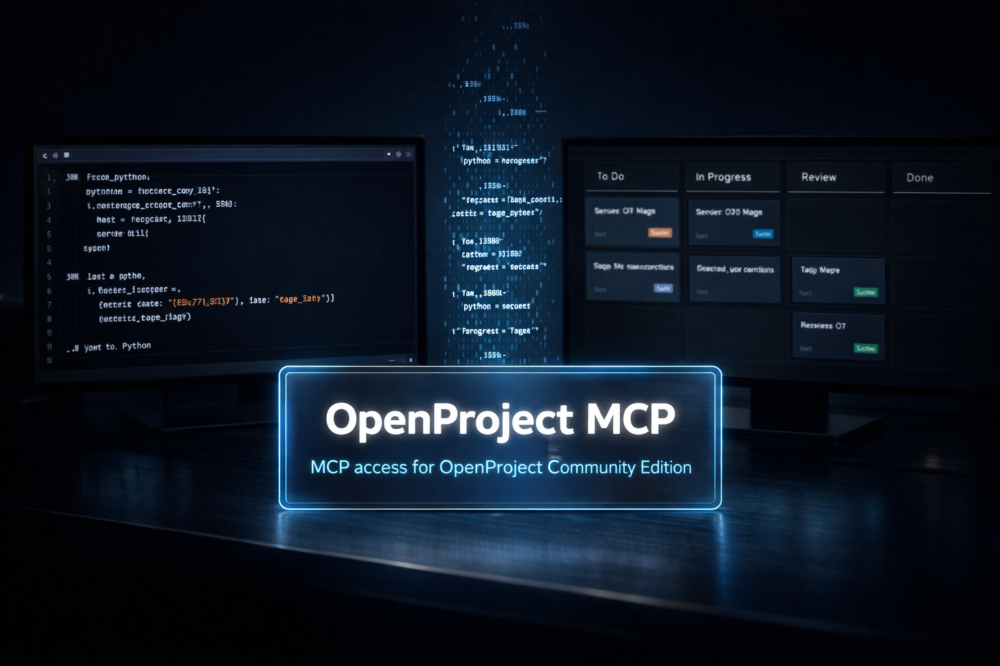

# OpenProject MCP

[](https://www.python.org/downloads/)
[](LICENSE)
[](https://modelcontextprotocol.io)

<p align="center">
  
</p>

An MCP server for OpenProject that lets local AI agents read and manage project data through structured, guarded tools.

The server runs as a local subprocess of your MCP client over stdio. It wraps OpenProject API v3 and exposes typed tools for projects, work packages, memberships, versions, boards, time entries, and more.

---

## Scope: Community Edition

This MCP server targets **OpenProject Community Edition** only. It does not support Enterprise Edition features such as:

- Placeholder Users
- Budgets
- Portfolios
- Programs
- Custom Actions
- Baseline Comparisons

**Note:** OpenProject Enterprise Edition includes its own MCP server. If you have an Enterprise license, use the official Enterprise MCP instead of this one.

---

## Table of Contents

- [What you can do](#what-you-can-do)
- [How it works](#how-it-works)
- [Getting started](#getting-started)
- [Configuration](#configuration)
- [Tools](#tools)
- [Integrations](#integrations)
- [Architecture](#architecture)
- [Development](#development)

---

## What you can do

**Projects**
- List, create, copy, update, and delete projects
- Read project configurations, lifecycle phases, and admin context
- Create, update, and delete memberships and versions; list roles

**Work packages**
- List and search work packages with structured filters
- Create, update, and delete work packages; create subtasks; create, update, and delete relations; add comments (no edit or delete)
- Upload and delete attachments; add and remove watchers; read activity logs
- Log, update, and delete time entries

**Boards and views**
- Create, read, update, and delete saved boards (queries); read views

**Users and groups**
- Read user accounts and group memberships
- Create, update, lock, unlock, and delete users; add and remove group members

**Supporting data**
- Read wiki pages; create, update, and delete news; read and update documents
- Read and mark notifications; read help texts, working days, and instance configuration
- Create and inspect grids; inspect custom options

All write operations follow a preview-then-confirm pattern by default: call a tool once to get a validated preview, then again with `confirm=true` to execute. This can be bypassed globally with `OPENPROJECT_AUTO_CONFIRM_WRITE=true`.

---

## How it works

- Communicates with the MCP client over stdio — no remote server, no persistent storage
- Reads are enabled by default; writes require explicit opt-in via environment variables
- Create and update operations validate the payload against OpenProject form endpoints before writing; delete and other simple operations execute directly once confirmed
- Project scope is enforced server-side: the MCP only exposes what the configured allowlists permit
- Responses are bounded and paginated — compact summaries, not raw HAL payloads

---

## Getting started

### Requirements

| | |
|---|---|
| Python | 3.10 or later |
| OpenProject | Community Edition 16.1 or later, API v3 accessible |
| OS | macOS 12+, Linux, or Windows 10/11 |

[`uv`](https://github.com/astral-sh/uv) is recommended for dependency management but not required.

### Prepare your OpenProject instance

An administrator must enable API token creation once:

**Administration → API and webhooks → API**

| Setting | Recommended |
|---|---|
| Enable API tokens | checked |
| Write access to read-only attributes | unchecked |
| Enable CORS | unchecked |

To create a personal token: **My account → Access tokens → + API token**. Copy the token immediately — it is only shown once. Format: `opapi-...`.

### Install

**macOS / Linux**

```bash
curl -fsSL https://raw.githubusercontent.com/jtauschl/openproject-mcp/main/get.sh | sh
```

**Windows (PowerShell)**

```powershell
irm https://raw.githubusercontent.com/jtauschl/openproject-mcp/main/get.ps1 | iex
```

The script clones the repo (to `~/openproject-mcp` or `%USERPROFILE%\openproject-mcp`), installs dependencies via `uv` if available or `venv` + `pip` otherwise, and runs the interactive setup that writes `.mcp.json`.

To override the destination:

```bash
DIR=~/tools/openproject-mcp curl -fsSL https://raw.githubusercontent.com/jtauschl/openproject-mcp/main/get.sh | sh
```

**Uninstall**

```bash
~/openproject-mcp/uninstall.sh    # macOS / Linux
```

---

## Configuration

`.mcp.json` contains your API token. Treat it like a password — it is gitignored by default.

Access is grouped into five chains: `project`, `membership`, `work_package`, `version`, and `board`. Each chain has a read flag and a write flag. The global `OPENPROJECT_ENABLE_READ` and `OPENPROJECT_ENABLE_WRITE` set all chains at once; scoped flags override them per chain.

| Variable | Required | Default | Description |
|---|---|---|---|
| `OPENPROJECT_BASE_URL` | yes | — | Base URL of your OpenProject instance, e.g. `https://op.example.com` |
| `OPENPROJECT_API_TOKEN` | yes | — | Personal API token |
| `OPENPROJECT_ENABLE_READ` | no | `true` | Enable all read chains at once |
| `OPENPROJECT_ALLOWED_PROJECTS_READ` | no | `*` | Readable projects by id, identifier, or title; comma-separated, `*` wildcards supported |
| `OPENPROJECT_ALLOWED_PROJECTS_WRITE` | no | empty | Writable projects; empty disables all project-scoped writes; always intersected with read scope |
| `OPENPROJECT_ALLOWED_PROJECTS` | no | — | Backward-compatible alias for `OPENPROJECT_ALLOWED_PROJECTS_READ` |
| `OPENPROJECT_ENABLE_PROJECT_READ` | no | inherits `OPENPROJECT_ENABLE_READ` | Projects, documents, news, wiki, lifecycle |
| `OPENPROJECT_ENABLE_MEMBERSHIP_READ` | no | inherits `OPENPROJECT_ENABLE_READ` | Memberships, roles, principals |
| `OPENPROJECT_ENABLE_WORK_PACKAGE_READ` | no | inherits `OPENPROJECT_ENABLE_READ` | Work packages, relations, attachments, time entries |
| `OPENPROJECT_ENABLE_VERSION_READ` | no | inherits `OPENPROJECT_ENABLE_READ` | Versions |
| `OPENPROJECT_ENABLE_BOARD_READ` | no | inherits `OPENPROJECT_ENABLE_READ` | Boards and views |
| `OPENPROJECT_HIDE_<ENTITY>_FIELDS` | no | empty | Comma-separated fields to omit from reads and reject on writes; `*` wildcards supported |
| `OPENPROJECT_HIDE_CUSTOM_FIELDS` | no | empty | Custom field names or keys to omit; `*` wildcards supported |
| `OPENPROJECT_ENABLE_WRITE` | no | `false` | Enable all write chains at once |
| `OPENPROJECT_ENABLE_PROJECT_WRITE` | no | inherits `OPENPROJECT_ENABLE_WRITE` | Project create/update/delete |
| `OPENPROJECT_ENABLE_MEMBERSHIP_WRITE` | no | inherits `OPENPROJECT_ENABLE_WRITE` | Membership create/update/delete |
| `OPENPROJECT_ENABLE_WORK_PACKAGE_WRITE` | no | inherits `OPENPROJECT_ENABLE_WRITE` | Work-package create/update/delete, comments, relations, attachments, time entries |
| `OPENPROJECT_ENABLE_VERSION_WRITE` | no | inherits `OPENPROJECT_ENABLE_WRITE` | Version create/update/delete |
| `OPENPROJECT_ENABLE_BOARD_WRITE` | no | inherits `OPENPROJECT_ENABLE_WRITE` | Board create/update/delete |
| `OPENPROJECT_AUTO_CONFIRM_WRITE` | no | `false` | Skip the preview step for all writes |
| `OPENPROJECT_AUTO_CONFIRM_DELETE` | no | inherits `OPENPROJECT_AUTO_CONFIRM_WRITE` | Skip the preview step for deletes |
| `OPENPROJECT_TIMEOUT` | no | `12` | Request timeout in seconds |
| `OPENPROJECT_VERIFY_SSL` | no | `true` | Verify TLS certificates |
| `OPENPROJECT_DEFAULT_PAGE_SIZE` | no | `20` | Default results per page |
| `OPENPROJECT_MAX_PAGE_SIZE` | no | `50` | Hard cap on results per request |
| `OPENPROJECT_MAX_RESULTS` | no | `100` | Hard cap on total results returned by a tool |
| `OPENPROJECT_LOG_LEVEL` | no | `WARNING` | `CRITICAL`, `ERROR`, `WARNING`, or `INFO` |

Supported entities for `OPENPROJECT_HIDE_<ENTITY>_FIELDS`: `project`, `membership`, `role`, `principal`, `project_access`, `project_admin_context`, `project_configuration`, `job_status`, `project_phase_definition`, `project_phase`, `view`, `document`, `news`, `wiki_page`, `category`, `attachment`, `time_entry_activity`, `time_entry`, `work_package`, `relation`, `activity`, `version`, `board`, `current_user`, `instance_configuration`.

**Never share your API token** in chat messages, screenshots, or log output. If a token has been exposed, revoke it immediately in **My account → Access tokens** and create a new one.

---

## Tools

Tools are grouped by area: projects, memberships, users, groups, work packages, versions, boards, time entries, wiki, news, documents, notifications, grids, and more.

See the full [tool reference](docs/tools.md) for descriptions of every tool.

---

## Integrations

**[Claude Code](docs/claude.md)**
Configure via `~/.claude.json` for user-wide access, or `.mcp.json` in the project root for repository-scoped access.

**[Codex](docs/codex.md)**
Configure via project `.codex/config.toml` or `~/.codex/config.toml`; `codex mcp add` is an optional CLI helper.

**[GitHub Copilot](docs/github.md)**
Configure via `.vscode/mcp.json` in the workspace.


---

## Architecture

Five files, no deep abstractions:

- `config.py` — environment parsing and safe defaults
- `client.py` — HTTP access, policy checks, HAL normalization, preview/confirm writes
- `models.py` — compact dataclasses returned to MCP clients
- `tools.py` — validated MCP tool handlers
- `server.py` — FastMCP lifecycle wiring

`client.py` is intentionally large: all policy-sensitive logic (read gates, write gates, project scoping, field hiding) lives in one place to make it easier to audit.

See [docs/architecture.md](docs/architecture.md) for request flow details and the safety model.

---

## Development

### Set up

```bash
git clone https://github.com/jtauschl/openproject-mcp.git
cd openproject-mcp

# option A: uv (recommended)
uv sync --dev

# option B: venv + pip
python3 -m venv .venv
.venv/bin/pip install -e ".[dev]"
```

### Run tests

```bash
# uv
uv run pytest tests/ -v

# venv
.venv/bin/python -m pytest tests/ -v
```

Tests use `httpx` mocks and run without a live OpenProject instance.

### After code changes

The MCP server runs as a subprocess. After any code change, restart the MCP client or reload the server (in Claude Code: `/mcp`) before updated tools become active.

---
