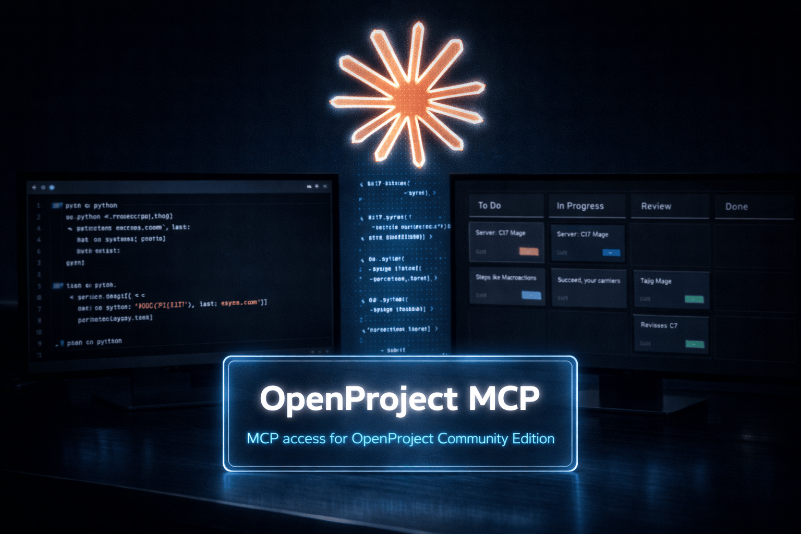

# Claude

<p align="center">
  
</p>

## Setup: Project-scoped (Preferred)

**Best practice:** Use `.mcp.json` in your project root. This allows different projects to have different OpenProject access and permissions.

### Steps

1. **Create `.mcp.json` in your project root:**
   ```bash
   python3 configure_mcp.py
   ```
   This interactive script creates the config with your credentials.

2. **Or manually: Create `.mcp.json`**
   - Reference: [`.mcp.json.example`](../.mcp.json.example)
   - Protect it if it contains secrets: `chmod 600 .mcp.json`

3. **Example config**
   ```json
   {
     "mcpServers": {
       "openproject": {
         "command": "/absolute/path/to/openproject-mcp/.venv/bin/openproject-mcp",
         "env": {
           "OPENPROJECT_BASE_URL": "https://op.example.com",
           "OPENPROJECT_API_TOKEN": "replace-with-your-token",

           "OPENPROJECT_ALLOWED_PROJECTS_READ": "my-project,other-project",
           "OPENPROJECT_ALLOWED_PROJECTS_WRITE": "my-project",

           "OPENPROJECT_ENABLE_PROJECT_READ": "true",
           "OPENPROJECT_ENABLE_MEMBERSHIP_READ": "true",
           "OPENPROJECT_ENABLE_WORK_PACKAGE_READ": "true",
           "OPENPROJECT_ENABLE_VERSION_READ": "true",
           "OPENPROJECT_ENABLE_BOARD_READ": "true",

           "OPENPROJECT_HIDE_PROJECT_FIELDS": "",
           "OPENPROJECT_HIDE_WORK_PACKAGE_FIELDS": "",
           "OPENPROJECT_HIDE_ACTIVITY_FIELDS": "",
           "OPENPROJECT_HIDE_CUSTOM_FIELDS": "",

           "OPENPROJECT_AUTO_CONFIRM_WRITE": "false",

           "OPENPROJECT_ENABLE_PROJECT_WRITE": "false",
           "OPENPROJECT_ENABLE_MEMBERSHIP_WRITE": "false",
           "OPENPROJECT_ENABLE_WORK_PACKAGE_WRITE": "false",
           "OPENPROJECT_ENABLE_VERSION_WRITE": "false",
           "OPENPROJECT_ENABLE_BOARD_WRITE": "false",

           "OPENPROJECT_TIMEOUT": "12",
           "OPENPROJECT_VERIFY_SSL": "true",
           "OPENPROJECT_DEFAULT_PAGE_SIZE": "20",
           "OPENPROJECT_MAX_PAGE_SIZE": "50",
           "OPENPROJECT_MAX_RESULTS": "100",
           "OPENPROJECT_LOG_LEVEL": "WARNING"
         }
       }
     }
   }
   ```

4. **Reload:** Restart Claude Code. Press **Cmd+Shift+P** and run "Developer: Reload Window"

---

## Setup: User-wide

**Alternative:** If you want to share one OpenProject MCP instance across all projects, use `~/.claude.json` (macOS/Linux) or the equivalent location for your OS.

- File: `~/.claude.json` (user home directory)
- Security: `chmod 600 ~/.claude.json` (read/write by you only)

**Note:** All projects share the same credentials and permissions. Project-scoped setup (above) is the preferred method.

**Example:**
```json
{
  "mcpServers": {
    "openproject": {
      "command": "/absolute/path/to/openproject-mcp/.venv/bin/openproject-mcp",
      "env": {
        "OPENPROJECT_BASE_URL": "https://op.example.com",
        "OPENPROJECT_API_TOKEN": "replace-with-your-token",

        "OPENPROJECT_ALLOWED_PROJECTS_READ": "*",
        "OPENPROJECT_ALLOWED_PROJECTS_WRITE": "",

        "OPENPROJECT_ENABLE_PROJECT_READ": "true",
        "OPENPROJECT_ENABLE_MEMBERSHIP_READ": "true",
        "OPENPROJECT_ENABLE_WORK_PACKAGE_READ": "true",
        "OPENPROJECT_ENABLE_VERSION_READ": "true",
        "OPENPROJECT_ENABLE_BOARD_READ": "true",

        "OPENPROJECT_HIDE_PROJECT_FIELDS": "",
        "OPENPROJECT_HIDE_WORK_PACKAGE_FIELDS": "",
        "OPENPROJECT_HIDE_ACTIVITY_FIELDS": "",
        "OPENPROJECT_HIDE_CUSTOM_FIELDS": "",

        "OPENPROJECT_AUTO_CONFIRM_WRITE": "false",

        "OPENPROJECT_ENABLE_PROJECT_WRITE": "false",
        "OPENPROJECT_ENABLE_MEMBERSHIP_WRITE": "false",
        "OPENPROJECT_ENABLE_WORK_PACKAGE_WRITE": "false",
        "OPENPROJECT_ENABLE_VERSION_WRITE": "false",
        "OPENPROJECT_ENABLE_BOARD_WRITE": "false",

        "OPENPROJECT_TIMEOUT": "12",
        "OPENPROJECT_VERIFY_SSL": "true",
        "OPENPROJECT_DEFAULT_PAGE_SIZE": "20",
        "OPENPROJECT_MAX_PAGE_SIZE": "50",
        "OPENPROJECT_MAX_RESULTS": "100",
        "OPENPROJECT_LOG_LEVEL": "WARNING"
      }
    }
  }
}
```

---

## Notes

- After changing the config, reload MCP servers: press **Cmd+Shift+P** and run "Developer: Reload Window"
- `OPENPROJECT_ALLOWED_PROJECTS_READ` accepts comma-separated identifiers or names: `project-one,project-two`. Use `*` for all visible projects
- `OPENPROJECT_ALLOWED_PROJECTS_WRITE` only narrows scope; it doesn't enable writes. Use the scoped `OPENPROJECT_ENABLE_*_WRITE` flags for the operations you need
