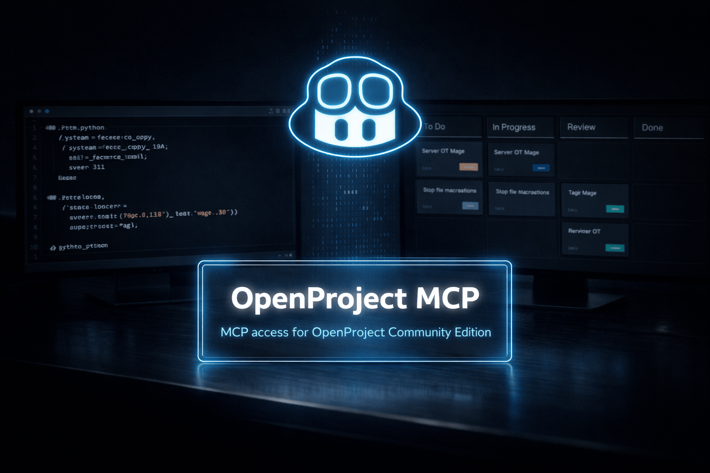

# GitHub

<p align="center">
  
</p>

This guide covers GitHub Copilot in Agent mode with VS Code.

## Setup: Workspace-scoped (Preferred)

**Best practice:** Use `.vscode/mcp.json` in your workspace. This allows different workspaces to have different OpenProject access and permissions.

### Steps

1. **Create `.vscode/mcp.json` in your workspace root**

2. **Protect it if it contains secrets:**
   ```bash
   chmod 600 .vscode/mcp.json
   ```

3. **Example config:**
   ```json
   {
     "servers": {
       "openproject": {
         "type": "stdio",
         "command": "/absolute/path/to/openproject-mcp/.venv/bin/openproject-mcp",
         "env": {
           "OPENPROJECT_BASE_URL": "https://op.example.com",
           "OPENPROJECT_API_TOKEN": "replace-with-your-token",

           "OPENPROJECT_ALLOWED_PROJECTS_READ": "my-project,other-project",
           "OPENPROJECT_ALLOWED_PROJECTS_WRITE": "my-project",

           "OPENPROJECT_ENABLE_PROJECT_READ": "true",
           "OPENPROJECT_ENABLE_MEMBERSHIP_READ": "true",
           "OPENPROJECT_ENABLE_WORK_PACKAGE_READ": "true",
           "OPENPROJECT_ENABLE_VERSION_READ": "true",
           "OPENPROJECT_ENABLE_BOARD_READ": "true",

           "OPENPROJECT_HIDE_PROJECT_FIELDS": "",
           "OPENPROJECT_HIDE_WORK_PACKAGE_FIELDS": "",
           "OPENPROJECT_HIDE_ACTIVITY_FIELDS": "",
           "OPENPROJECT_HIDE_CUSTOM_FIELDS": "",

           "OPENPROJECT_AUTO_CONFIRM_WRITE": "false",

           "OPENPROJECT_ENABLE_PROJECT_WRITE": "false",
           "OPENPROJECT_ENABLE_MEMBERSHIP_WRITE": "false",
           "OPENPROJECT_ENABLE_WORK_PACKAGE_WRITE": "false",
           "OPENPROJECT_ENABLE_VERSION_WRITE": "false",
           "OPENPROJECT_ENABLE_BOARD_WRITE": "false",

           "OPENPROJECT_TIMEOUT": "12",
           "OPENPROJECT_VERIFY_SSL": "true",
           "OPENPROJECT_DEFAULT_PAGE_SIZE": "20",
           "OPENPROJECT_MAX_PAGE_SIZE": "50",
           "OPENPROJECT_MAX_RESULTS": "100",
           "OPENPROJECT_LOG_LEVEL": "WARNING"
         }
       }
     }
   }
   ```

4. **Reload:** Press **Cmd+Shift+P** and run "Developer: Reload Window"

---

## Setup: User-wide

**Alternative:** Use the user `mcp.json` if you want the server available in all workspaces.

1. **Press Cmd+Shift+P** and select "Open User MCP Settings"
2. **Add the same config** as above (workspace-scoped example)
3. **Reload:** Press **Cmd+Shift+P** and run "Developer: Reload Window"

**Note:** All workspaces share the same credentials and permissions. Workspace-scoped setup (above) is the preferred method.

---

## Notes

- Switch Copilot Chat to Agent mode so MCP tools are available
- Workspace-scoped setup (`.vscode/mcp.json`) is preferred for fine-grained project permissions
- Avoid hardcoding sensitive information when possible. VS Code recommends using environment files or input variables
- After changing the config, reload: **Cmd+Shift+P** → "Developer: Reload Window"
- `OPENPROJECT_ALLOWED_PROJECTS_READ` accepts comma-separated identifiers or names: `project-one,project-two`. Use `*` for all visible projects
- `OPENPROJECT_ALLOWED_PROJECTS_WRITE` only narrows scope; it doesn't enable writes. Use the scoped `OPENPROJECT_ENABLE_*_WRITE` flags for the operations you need
